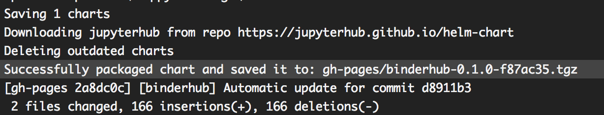

# [mybinder.org-deploy][]

This repository contains configuration files and documentation related to the
[binderhub][] deployment open to the public at [beta.mybinder.org][].

**Important: If you wish to deploy your own Binder instance, please do not
use these files as they are specific to [mybinder.org][].** Instead, you should
refer to the [`jupyterhub/binderhub`][] repo and the
[BinderHub documentation][].

## Basics

This repo contains two branches: `staging` and `beta`. The `staging` branch
corresponds to the config for [staging.mybinder.org][] and the `beta`
branch to [beta.mybinder.org][]. In general (except when performing a
deployment), these branches should always be the same, and `beta` should not
drift away from `staging` too much.

## Deploying a change

Deploying a change follows a two-step process. First, you'll deploy to
the `staging` branch of the repository. Second, if all looks well, you'll
deploy to the production branch of the repository (called `beta`).

1. Make the changes on your fork.
2. Make a PR to the `staging` branch with the changes you want.
3. Review, accept, and merge this PR. This will make Travis deploy the changes
   to [staging.mybinder.org][].
4. Go to [staging.mybinder.org][] to look at the changes.
5. Verify that [staging.mybinder.org][] works as intended. Please take your
   time to check that the change is working as expected.

**If the changes look correct:**

6. Make a new PR, merging [staging][] into the [beta][] branch.
7. Get this PR merged, and wait for Travis to make a deployment to [beta][].
8. Verify that [beta.mybinder.org][] works as intended. Please take your
   time to check that the change is working as expected.
9. CELEBRATE! :tada:

**If the changes don't look correct, or there is an error:**

6. **Immediately revert the PR that was made to the [staging][] branch.**
7. Verify that [staging.mybinder.org][] is working as it was before the PR
   and revert.
8. Troubleshoot and make changes to your fork. Repeat the process from Step 1.

## Upgrading dependencies for the mybinder.org deployment

Upgrading dependencies used by [mybinder.org][] requires making changes
to the `config` files of repositories that are used to build the
[mybinder.org][] service. The following sections cover how to do upgrade
dependencies for [BinderHub][] and [repo2docker][]. In each case, you'll need
to deploy these changes by following the steps above in [Deploying a change][].

### BinderHub

This section explains how to upgrade the [mybinder.org][] deployment after
making a change in the [BinderHub][] repo.

1. Merge changes to [BinderHub][].
2. Open the [Travis build for BinderHub](https://travis-ci.org/jupyterhub/binderhub),
   navigate to the page corresponding to the master branch.
3. If the build succeeds, grab the hash that is displayed at the end of the
   travis output. It looks something like:

       create mode 100644 binderhub-0.1.0-fbf6e5a.tgz

   The hash is the string at the very end, between `-` and `.tgz`. In this
   example, it is `fbf6e5a`.

   

4. In your fork of the [mybinder.org-deploy][] repository, open
   `config/common.yaml`.
5. Toward the beginning of the file, you will see a line similar to:

       version: 0.1.0-9623b55

   Replace the existing hash that comes just after the `-`. In this example,
   replace `9623b55`  with the hash `fbf6e5a`that you've copied in step 3. The
   edited line will be:

       version: 0.1.0-fbf6e5a

6. Merge this change to `config/common.yaml` into the [mybinder.org-deploy][]
   repository following the steps in the [Deploying a change][] section above
   to deploy the change to [staging][], and then [beta][].

### repo2docker

This section explains how to upgrade the [mybinder.org][] deployment after
making a change in the [repo2docker][] repo.

1. Merge changes to [repo2docker][].
2. Open the [Travis build for repo2docker](https://travis-ci.org/jupyter/repo2docker),
   find the text:

       Pushed new repo2docker image: <YOUR-IMAGE-NAME>

   Copy the text in `<YOUR-IMAGE-NAME>`. **Note**: You may need to unfold the
   code in the `Deploying application` line in order to see this text.
3. In your fork of the [mybinder.org-deploy][] repository, open
   `config/common.yaml`.
4. Toward the end of the file you will see `repo2dockerImage`, replace the
   text that is there with what you copied in step 2. For example, the
   edited file will look similar to:

       repo2dockerImage: jupyter/repo2docker:65d5411

5. Merge this change to `config/common.yaml` into the [mybinder.org-deploy][]
   repository following the steps in the [Deploying a change][] section above
   to deploy the change to [staging][], and then [beta][].

## Repository structure

This repository contains purely config files.

### `config` directory

This contains config YAML files that fully describe the current state of the
mybinder.org deployment:

- `common.yaml`: public, non-secret settings that are common to both
  `staging` and `production` deployments.
- `staging.yaml`: config that is specific to the `staging` mybinder, which
  lives [here](https://binder.binder-staging.omgwtf.in/) (will move at some
  point to `staging.mybinder.org`)
- `beta.yaml`: config specific to the `beta` mybinder.

**Important**: For maintainability and consistency, we try to keep the contents
of `staging.yaml` and `beta.yaml` super minimal - they should be as close
to each other as possible. We want `staging` to mirror `beta` so we can test
things before pushing them out.

### `config/secret` subdirectory

This contains files that should be kept *'secret'* from the rest of the world
i.e. secret keys, cookie secrets, etc. Though secret, keeping them in the git
repo is the simplest and easiest way to distribute them securely to
**deployment team** members. We use [git-crypt](https://github.com/AGWA/git-crypt)
for this purpose.

- `staging.yaml` has secrets specific to the `staging` mybinder.
- `beta.yaml` has secrets specific to the `beta` mybinder.
- `common.yaml` has secrets specific to both `staging` and `beta` mybinders.

### `support` directory

This contains a set of third party charts which we use for supporting our own
code on the `mybinder` deployment. The charts we use and their versions are
specified in `requirements.yaml`, and the configuration of those charts is in
`values.yaml`.

### Related repositories

Related repositories used by the [mybinder.org][] service are:

1. [binderhub][]

   This contains the [binderhub][] code (UI & hub management) & helm chart.
   To change the UI / UX or hub management aspects of [mybinder.org][],
   go to [binderhub][].

2. [repo2docker][]

   This is used to do the actual building of git repositories into docker
   images, and can be used standalone too. If you want to change how a git
   repository is converted into a docker image to be run for the user,
   go to [repo2docker][].

[mybinder.org-deploy]: https://github.com/jupyterhub/mybinder.org-deploy
[mybinder.org]: https://beta.mybinder.org
[beta.mybinder.org]: https://beta.mybinder.org
[beta]: https://beta.mybinder.org
[staging.mybinder.org]: https://staging.mybinder.org
[staging]: https://staging.mybinder.org
[BinderHub]: https://github.com/jupyterhub/binderhub
[binderhub]: https://github.com/jupyterhub/binderhub
[`jupyterhub/binderhub`]: https://github.com/jupyterhub/binderhub
[BinderHub documentation]: https://binderhub.readthedocs.io/en/latest/
[repo2docker]: http://github.com/jupyter/repo2docker
[Deploying a change]: #deploying-a-change
