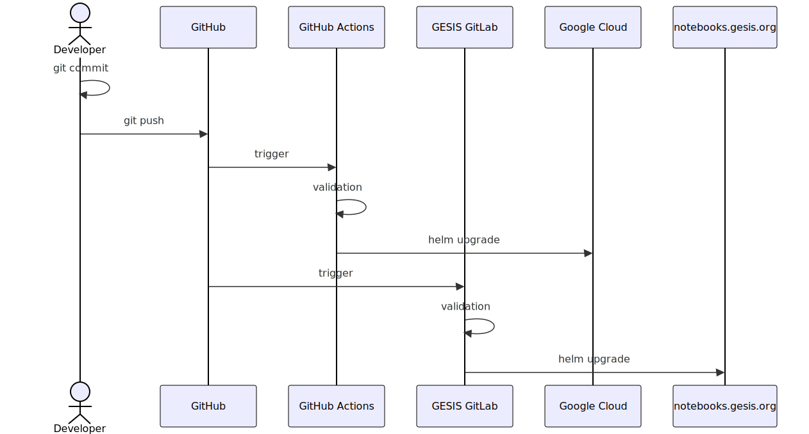

# How to deploy a change to notebooks.gesis.org?

[GESIS Leibniz Institute for the Social Sciences](https://www.gesis.org) is a member of the [mybinder.org federation](https://mybinder.readthedocs.io/en/latest/about/status.html). GESIS has on-premise servers and use it for the mybinder.org server. The use of on-premise servers requires a separate deployment because the access to the servers using SSH requires the tunelling using a VPN.

<!--
sequenceDiagram
    actor developer as Developer
    participant git as GitHub
    participant github-actions as GitHub Actions
    participant gesis-gitlab as GESIS GitLab
    participant gcp as Google Cloud
    participant gesis-notebooks as notebooks.gesis.org

    developer->>developer: git commit
    developer->>git: git push
    git->>github-actions: trigger
    github-actions->>github-actions: validation
    github-actions->>gcp: helm upgrade
    git->>gesis-gitlab: trigger
    gesis-gitlab->>gesis-gitlab: validation
    gesis-gitlab->>gesis-notebooks: helm upgrade
-->

## GESIS GitLab CI/CD Server

GESIS GitLab server runs [GitLab Community Edition v16.11.6](https://gitlab.com/gitlab-org/gitlab-foss/-/tags/v16.11.6) with [continuous integration (CI) and continuous delivery (CD)](https://about.gitlab.com/topics/ci-cd/) enable.

The CI/CD jobs are defined in [`.gitlab-ci.yml`](https://github.com/jupyterhub/mybinder.org-deploy/tree/main/.gitlab-ci.yml).

## Kubernetes on bare metal

Cloud environments provide a load balancer to the Kubernetes clusters. Unfortunately, Kubernetes cluster does not includes a default implementation of a load balancer for the scenario that it is running on bare metal. Because of this, the deployment of mybinder.org to GESIS servers must include the configuration of a load balancer. We are using [MetalLB](https://metallb.universe.tf/) with [Ingress NGINX Controller](https://kubernetes.github.io/ingress-nginx/).

## Virtual Private Server configuration with Ansible

We use [Ansible](https://www.ansible.com/) to automate the configuration of the virtual private server (VPS) provided by GESIS. After a successful configuration, we will have a operational Kubernetes cluster to deploy mybinder.org.
