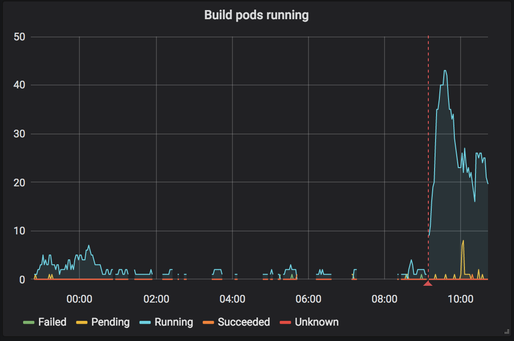
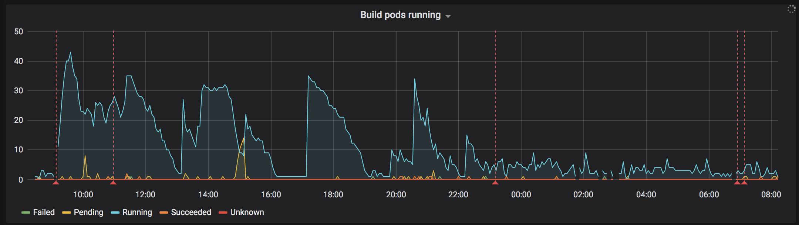
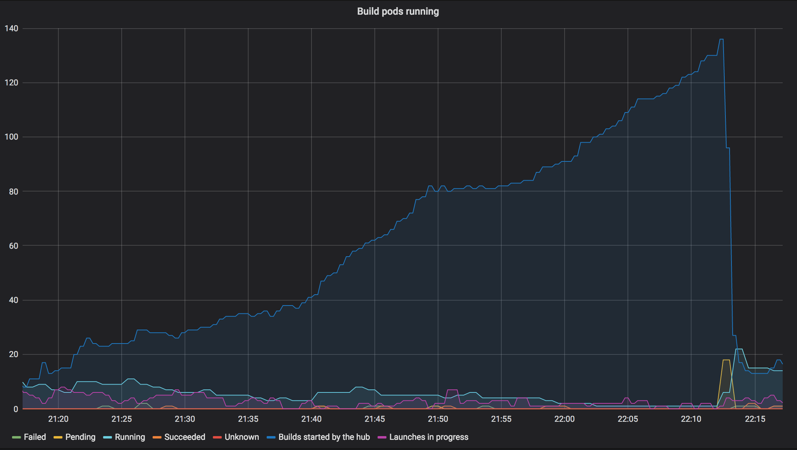

# 2019-03-24, repo2docker upgrade and docker image cache wipe

## Summary

User's experienced long wait times for the images to build, fixed by banning
the JupyterLab demo repository. The problem was that a single repository that
is very popular and takes a long time to build will end up consuming all
available "build slots". Incident lasted most on Sunday day in Europe.

## Timeline

All times in UTC+1 (Zurich time)

### 2019-03-24 8:54

Start of incident. New version of repo2docker is deployed and the build prefix
is bumped. This effectively clears the docker image cache. Repositories start
building. We quickly accumulate build pods. Things appear to work.

### 18:45

Builds are backlogged. As not a lot of binders are running the auto-scaled
cluster is small which limits the amount of resources available to build images.
Decision taken to add two new nodes to provide additional
resources for building pods

### 18:54

Two new nodes were added as a separate node pool. These nodes had no "Local SSD"
assigned to them. This was a mistake in setting up the node pool.

### 19:14

New builds weren't starting, number of running build pods kept decreasing.
When triggering a new build and watching the logs we never see a log message
that the build pod has been launched. This is consistent with the UI on the web
interface. However unclear why the build pods are not being launch.

Suspect something is "stuck" in the BinderHub
pods, restarted one of them. New builds start happening.

### 19:57

Reports of builds happening but then erroring with "no disk space", images
are not pushed to the registry. Notice that the extra node pool does not have
local SSD drives after ssh'ing to some old and new nodes and comparing output
of `df -h` on each. Recreate node pool with correctly configured nodes.

Restarted the second bhub pod.

### 22:18

Notice that builds are not starting and number of running build pods is low.

Start investigating where the builds are queued. Added a new metric to the
"Running Build Pods" chart on grafana to show number of builds "started" by
BinderHub.

Each "build" is either someone requesting a repository that has not been built
or is in the process of being built. The number of actually running builds keeps
decreasing over time, while the number of "started builds" keeps growing. The
big drop is when we deleted the build pod for the JupyterLab demo repository

### 22:36

Decide to start a build for JupyterLab demo repo and then ban it to allow
other repository builds to make progress. Once the JLab build is done we will
unban it again.

### 2019-03-25 7:01am

JupyterLab demo repo build completed, repository was unbanned again.
Incident resolved.

## Lessons learnt

### What went well

List of things that went well. For example,

1. We managed to update repo2docker and wipe the build cache without causing
   a total outage.

### What went wrong

Things that could have gone better. Ideally these should result in concrete
action items that have GitHub issues created for them and linked to under
Action items. For example,

1. We generate a lot of load when wiping the cache and had no ready-to-go
   instructions for adding extra nodes to the cluster.

### Where we got lucky

These are good things that happened to us but not because we had planned for them.
For example,

1. Users were super understanding and supportive that things were slow and builds
   did not start for several hours.

## Action items

### Process improvements

1. Need to devise a strategy for wiping the build cache without generating a huge
   load.

### Documentation improvements

1. Add a command that can be copy&pasted to add a new node pool to avoid
   configuration errors.

### Technical improvements

1. Change our build thread pool setup so that a single slow to build and popular
   repository does not end up using all available build slots.
