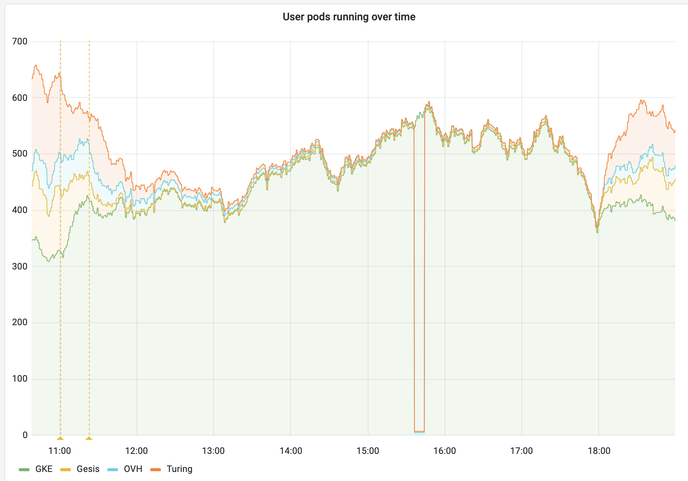
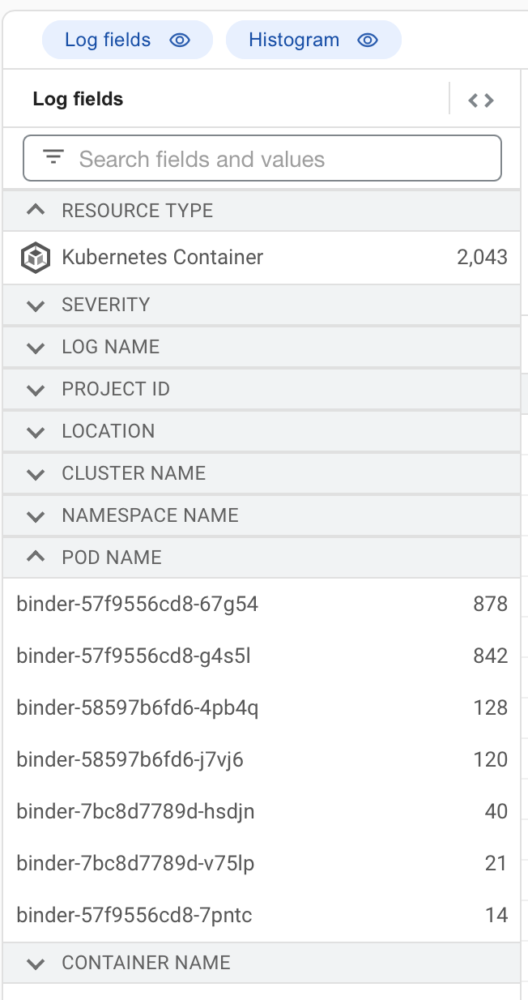

# 2022-01-27, stale prime version

## Summary

A bug in the federation-redirect health checks
kept the reference version from being updated,
preventing traffic from being sent to other federation members.

This effect lasted approximately nine hours before normal operation was restored without intervention.



## Timeline

All times in CET

### 2022-01-27 11:00

A routine bump of binderhub and reop2docker versions is deployed.
Traffic to federation members other than GKE begins to drop.

At this point, the prime cluster (GKE) is 'full' according to its pod quota.

Due to a bug in federation-redirect,
as long as a cluster is full,
its version is not checked.

However, the version of the prime cluster is used as a reference
when comparing with other federation members.

As long as the prime cluster stays 'full' (or unhealthy for any reason),
the reference version will be out of date,
Any actually up-to-date federation members will be considered to have mismatched version,
and will not receive any redirect traffic.

### 14:35

Federation members notice drop in traffic.

### 18:00

GKE load drops below quota,
allowing the prime version to be updated in the federation-redirector.
At this point, traffic to all federation members returns to normal.

### 2022-01-28 09:00

Investigations starts.

federation-redirect logs show that the version mismatch is the cause of the drop in traffic,
and that the 'prime' version is the one that's out-of-date.

Initial suspicion was an out-of-date binder pod was still receiving traffic.
Exploring logs in GCP logs explorer eventually eliminated this possibility.

Useful log query:

```
resource.type="k8s_container" resource.labels.cluster_name="prod"
resource.labels.container_name="binder"
"GET / "
```

It was useful to expand the "Log Fields" to see the counts by pod name within the time frame:



A brief digression reduced trust in GCP logs because it is clear that the "Kubernetes Pod" resource logs are missing many entries:

```
resource.type="k8s_pod" resource.labels.cluster_name="prod"
resource.labels.pod_name=~"^binder.*"
```


### 2022-01-28 10:00

Underlying issue in federation-redirect is identified and [fixed][fix-pr].

## Lessons learnt

### What went well

1. Cluster healed itself when traffic dropped below the prime cluster's pod quota.
2. federation-redirect logs clearly showed it was the version mismatch preventing traffic.


### What went wrong

1. federation-redirect did not have the correct 'prime version' for 9 hours, due to load on the prime cluster ([fixed][fix-pr])
2. Response time was low. The issue went unnoticed for 3 hours,
   and without action for at least 9 hours (when it resolved itself).
   We do not currently have much int he way of proactive 'alerting' ([issue][alerting-issue]),
   so only when grafana or the status page is being watched do we notice issues like this.
3. The health of the cluster is not immediately visible except in logs or long-term traffic trends,
   which can take a while to be noticed ([issue][metrics-issue]).
   We do have most of these checks reimplemented on [the status page][status],
   but not the actual values as considered by the redirector (bugs and all).
   Notably, the status page does not include the version check,
   which caused this incident.

[status]: https://mybinder.readthedocs.io/en/latest/about/status.html


### Where we got lucky

1. Federation 'as a whole' handled the traffic okay,
   because the prime cluster can actually handle more traffic than its pod quota.
   That said, if we actually stopped routing traffic to the prime cluster while it is unhealthy,
   the issue would hav been resolved in minutes
   because it would not have stayed full.

## Action items

### Process improvements

1. Implement proactive alerts. This is a longstanding issue we have yet to address ([issue][alerting-issue]).


### Technical improvements

1. Fix bug preventing prime cluster's version from being updated while it is full ([pull request][fix-pr])
2. Add metrics for the federation-redirect service to improve visibility of federation health issues ([issue][metrics-issue])
3. Consider allowing the prime cluster to stop accepting traffic when it is unhealthy ([issue][full-issue])


[alerting-issue]: https://github.com/jupyterhub/mybinder.org-deploy/issues/611
[metrics-issue]: https://github.com/jupyterhub/mybinder.org-deploy/issues/2114
[fix-pr]: https://github.com/jupyterhub/mybinder.org-deploy/pull/2113
[full-issue]: https://github.com/jupyterhub/mybinder.org-deploy/issues/2115
