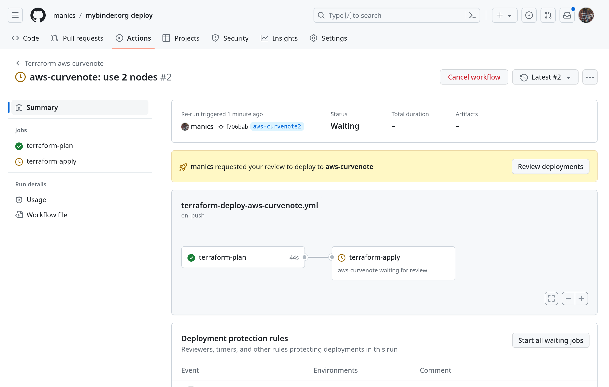
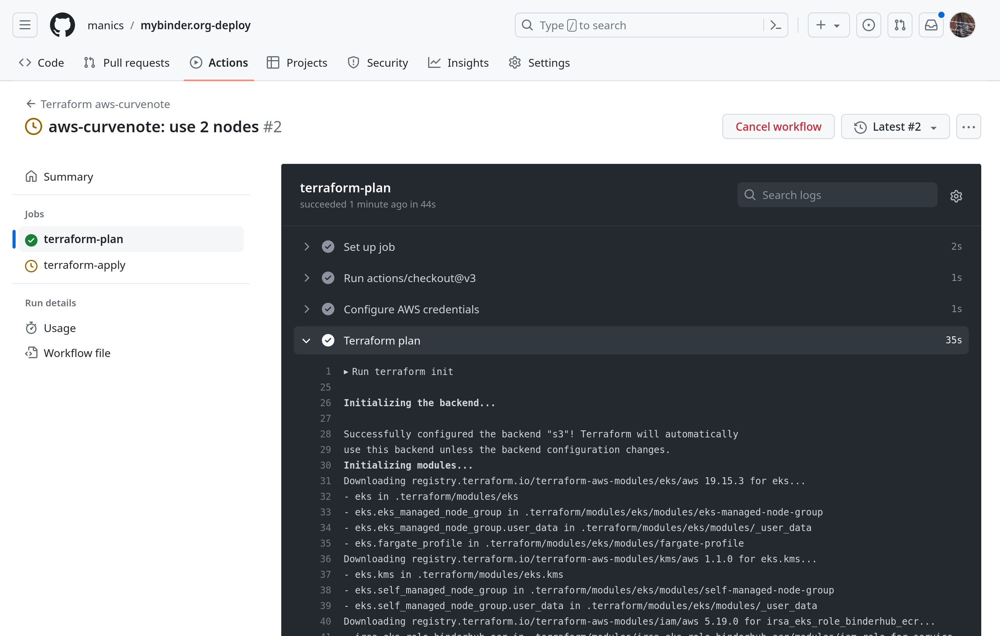
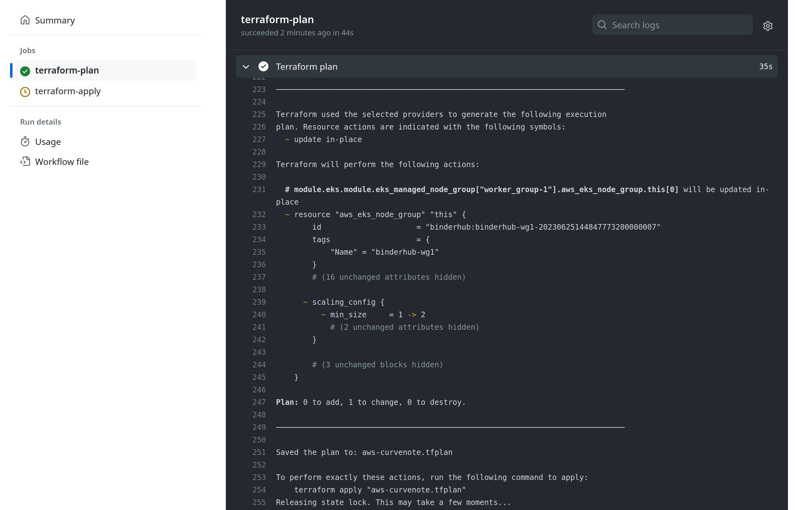
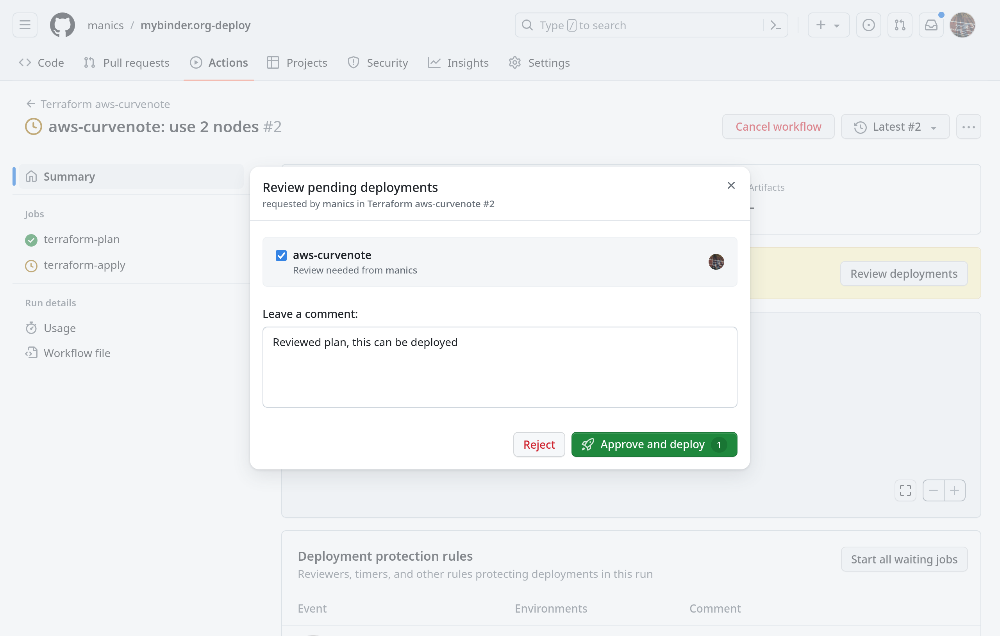

# AWS infrastructure on CurveNote

This deployment is run in an [AWS account owned by Curvenote](https://github.com/jupyterhub/mybinder.org-deploy/issues/2629), with restricted user accounts provided to the mybinder team.

## AWS account prerequisites

IAM roles, users, and some other base infrastructure is defined in a separate private repository under the control of the AWS account administrator.
Contact the mybinder team and @stevejpurves to obtain access.

## Manual bootstrapping (new deployment only)

The Terraform state file is stored in a remote S3 bucket which must be created before the first deployment, along with a DynamoDB lock.
This should only be run once!

```
cd bootstrap
terraform init
terraform apply
cd ..
```

If you want to use this to create multiple deployments you **must** modify

`terraform { backend "s3" { ... } }`

in [`provider.tf`](provider.tf) to use a different key and/or bucket.
Failure to do this will result in the original deployment becoming unmanageable- it will not be possible to modify or even delete it with Terraform!

## Manual deployment

Ensure you have a recent version of Terraform.
The minimum required version is specified by `terraform { required_version } }` in [`provider.tf`](provider.tf).

The full deployment requires an OIDC Provider that must be created by a privileged AWS administrator.

Deploy the Kubernetes cluster without the OIDC Provider by setting the following [variables](variables.tf):

```
enable_irsa = false
```

```
terraform init
terraform apply
```

Copy [`openid_connect_providers.tf.example`](./openid_connect_providers.tf.example) and edit the `resource "aws_iam_openid_connect_provider" "binderhub_eks_oidc_provider" { thumbprint_list, url }` fields, using the values from [`outputs.tf`](./outputs.tf).

Ask the AWS account administrator to create the OIDC Provider, and retrieve the OIDC binderhub provider ARN.

Set

```
oidc_created = true
```

and deploy again

```
terraform apply
```

## Obtaining a kubeconfig file

You must have the AWS CLI (v2 is recommended) and kubectl in your PATH.

You must assume the `arn:aws:iam::<AWS_ACCOUNT_ID>:role/binderhub-eks-access` role to obtain a kubeconfig file.
Assuming your AWS credentials are already setup, for example in a profile called `aws-curvenote`, the easiest way to do this is to [add a second profile](https://docs.aws.amazon.com/cli/latest/userguide/cli-configure-role.html) in `~/.aws/config`:

```
[profile aws-curvenote-binderhub-eks-access]
region = us-east-2
role_arn = arn:aws:iam::<AWS_ACCOUNT_ID>:role/binderhub-eks-access
source_profile = <name-of-your-aws-curvenote-profile>
```

Obtain a kubeconfig file

```
aws --profile=aws-curvenote-binderhub-eks-access eks update-kubeconfig --name binderhub --kubeconfig /path/to/kubeconfig

kubectl --kubeconfig=/path/to/kubeconfig get nodes
```

Note: The AWS user who deployed the cluster [automatically has admin access to the cluster](https://docs.aws.amazon.com/eks/latest/userguide/add-user-role.html)- this is not configurable.
To minimise confusion always assume the `binderhub-eks-access` IAM role to create the kubeconfig.

## Automatic deployment (GitHub workflows)

This infrastructure deployment can be partially managed by the
[`terraform-deploy-aws-curvenote.yml` GitHub workflow](../../../.github/workflows/terraform-deploy-aws-curvenote.yml) that runs in two stages:

1. The first job runs `terraform plan`.
   If there are infrastructure changes the diff is shown in the job output and an encrypted Terraform plan artifact is uploaded.
2. The second job is linked to the environment `aws-curvenote`, and requires a
   [manual approval step](https://docs.github.com/en/actions/managing-workflow-runs/reviewing-deployments).
   Check the planned changes from the first job, before either approving or rejecting the job.
   If approved `terraform apply` will be run.

Since infrastructure pull requested aren't tested this allows the actual production changes to be reviewed before deployment.

The role assumed by GitHub for this deployment does not have sufficient rights to deploy all changes, most notably it cannot create new IAM roles.
It should be sufficient for most routine changes such as Kubernetes upgrades or changes to the cluster size.
For more complex changes the deployment should be run manually first.

### Example approval

If `terraform-plan` found changes a request for approval will be sent:


Open the `terraform-plan` job:


Check the planned changes in the `Terraform plan` step:


If the changes are acceptable approve the deployment:


This should start the `terraform-apply` job which will apply the saved plan.

### GitHub secrets and environment setup

A GitHub secret `TFPLAN_ARTIFACT_PASSPHRASE` must be created so the Terraform plan artifact can be encrypted/decrypted.
This is because the plan may contain sensitive information so must not be visible to downloaders.
This passphrase is only needed by the GitHub workflow, it is never required outside the workflow so should be set to a long one-off random string which is not recorded anywhere else.
It can be rotated at any time between deployments.

The GitHub environment `aws-curvenote` must be created before the first deployment with the following settings:

- Only branch `main` can deploy to this environment
- Require reviewers to approve deployments

## Accessing Kubernetes from a GitHub workflow

All access to the Kubernetes cluster is managed using [GitHub OIDC](https://docs.github.com/en/actions/deployment/security-hardening-your-deployments/configuring-openid-connect-in-amazon-web-services).

AWS secret tokens are not required.
AWS API access for BinderHub components, for example to ECR, is managed using [IRSA](https://docs.aws.amazon.com/eks/latest/userguide/iam-roles-for-service-accounts.html).
